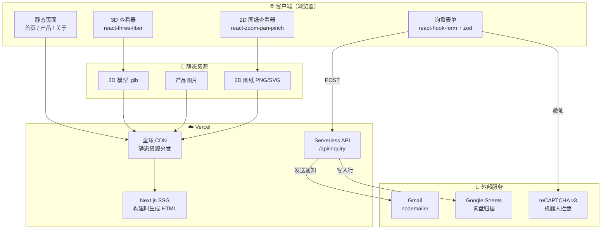
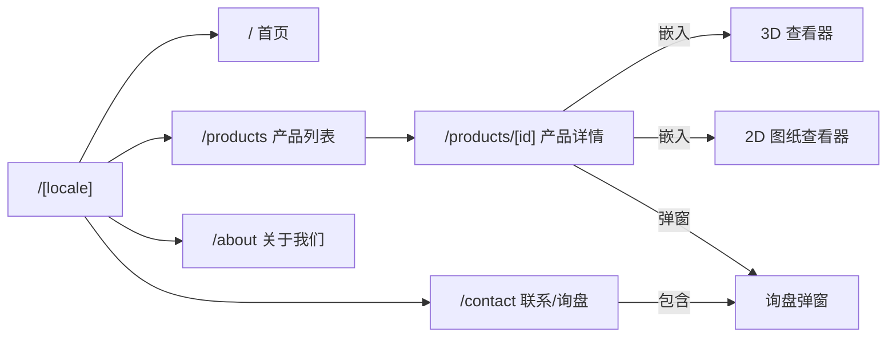
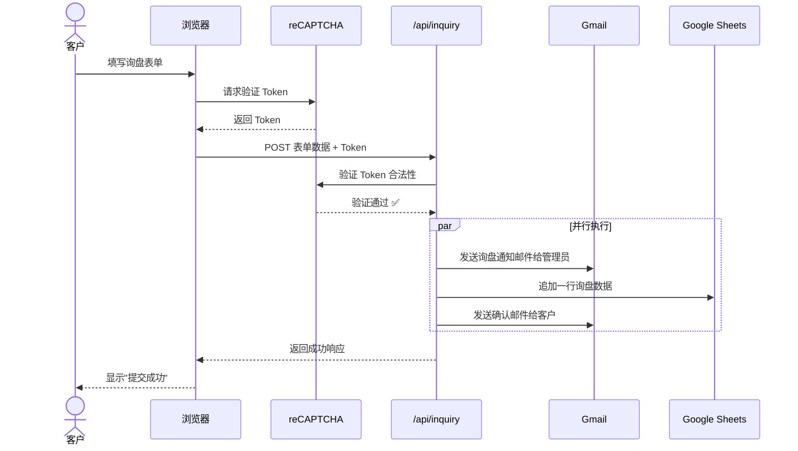
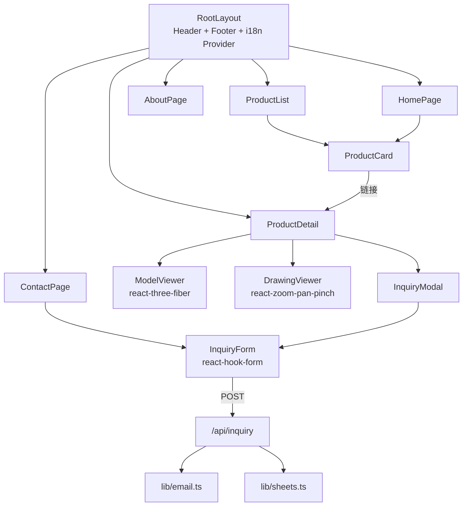

# 02 系统架构

> 单一事实来源 — 先图后码，所有开发以本文档为准
> 
> 📐 可视化预览：用浏览器打开 `doc/architecture_preview.html` 可放大查看所有图表

---

## 一、高层系统架构



---

## 二、页面路由结构



> `[locale]` = `en` | `zh`，由 `next-intl` 中间件自动路由

---

## 三、询盘数据流（核心业务流程）



---

## 四、项目目录结构

```
waimao-dulizhan/
├── public/
│   ├── models/           ← 3D 模型 (.glb)
│   ├── drawings/         ← 2D 图纸 (.png/.svg)
│   └── images/           ← 产品照片、公司图片
├── src/
│   ├── app/
│   │   ├── [locale]/     ← 多语言动态路由
│   │   │   ├── page.tsx           ← 首页
│   │   │   ├── products/
│   │   │   │   ├── page.tsx       ← 产品列表
│   │   │   │   └── [id]/page.tsx  ← 产品详情
│   │   │   ├── about/page.tsx     ← 关于我们
│   │   │   └── contact/page.tsx   ← 联系/询盘
│   │   ├── api/
│   │   │   └── inquiry/route.ts   ← 询盘 API
│   │   └── layout.tsx             ← 全局布局
│   ├── components/
│   │   ├── layout/        ← Header / Footer / Nav
│   │   ├── product/       ← ProductCard / ModelViewer / DrawingViewer
│   │   ├── inquiry/       ← InquiryForm / InquiryModal
│   │   └── ui/            ← Button / Input 等通用组件
│   ├── lib/               ← 工具函数（邮件发送、Sheets 写入等）
│   ├── data/              ← 产品数据 JSON
│   └── i18n/              ← 翻译字典 en.json / zh.json
├── doc/                   ← 📐 架构白板文档（你正在看的）
└── content/               ← (预留) MDX 内容
```

---

## 五、组件依赖关系


