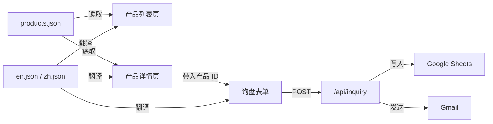

# 03 数据模型

> 极简原则 — 只定义业务必需的字段，杜绝过度设计

---

## 一、产品数据 (Product)

> 文件位置：`src/data/products.json`
> 说明：纯 JSON 静态数据，不用数据库。添加产品 = 往 JSON 里加一条

```typescript
// src/types/product.ts

interface Product {
  id: string;                  // 唯一标识，如 "wood-fiber-board-rect-01"
  category: string;            // 分类，如 "cutting-board"
  images: string[];            // 产品图片路径，如 ["/images/board-01.jpg", ...]
  model3d?: string;            // 3D 模型路径（可选），如 "/models/board-01.glb"
  drawing2d?: string;          // 2D 图纸路径（可选），如 "/drawings/board-01.png"
  specs: {
    dimensions: string;        // 尺寸，如 "400 × 280 × 18 mm"
    weight: string;            // 重量，如 "850g"
    material: string;          // 材质，如 "Wood Fiber Composite"
    color: string[];           // 可选颜色，如 ["Natural", "Walnut", "Black"]
    moq: string;               // 最低起订量，如 "500 pcs"
    leadTime: string;          // 交期，如 "25-30 days"
    packaging: string;         // 包装，如 "Shrink wrap + Carton"
  };
  features: string[];          // 卖点关键词，如 ["Anti-bacterial", "BPA Free"]
  createdAt: string;           // 上架时间，如 "2026-02-24"
}
```

### 示例数据

```json
{
  "id": "wood-fiber-board-rect-01",
  "category": "cutting-board",
  "images": ["/images/board-01-a.jpg", "/images/board-01-b.jpg"],
  "model3d": "/models/board-01.glb",
  "drawing2d": "/drawings/board-01.png",
  "specs": {
    "dimensions": "400 × 280 × 18 mm",
    "weight": "850g",
    "material": "Wood Fiber Composite",
    "color": ["Natural", "Walnut"],
    "moq": "500 pcs",
    "leadTime": "25-30 days",
    "packaging": "Shrink wrap + Carton"
  },
  "features": ["Anti-bacterial", "BPA Free", "Dishwasher Safe", "Eco-friendly"],
  "createdAt": "2026-02-24"
}
```

---

## 二、询盘表单数据 (InquiryForm)

> 客户在网站上提交的表单字段

```typescript
// src/types/inquiry.ts

interface InquiryForm {
  companyName: string;         // 必填 — 公司名称
  contactName: string;         // 必填 — 联系人
  email: string;               // 必填 — 邮箱（需验证格式）
  phone?: string;              // 选填 — 电话 / WhatsApp
  country: string;             // 必填 — 国家/地区
  products?: string[];         // 选填 — 感兴趣的产品 ID
  quantity?: string;           // 选填 — 预计采购量
  message?: string;            // 选填 — 定制需求描述
  sourcePage: string;          // 自动记录 — 从哪个页面提交的
  recaptchaToken: string;      // 自动获取 — reCAPTCHA 验证令牌
}
```

---

## 三、Google Sheets 归档结构

> 每条询盘自动写入一行，字段顺序如下：

| 列 | 字段 | 来源 |
|----|------|------|
| A | 提交时间 | 服务端自动生成 |
| B | 公司名称 | companyName |
| C | 联系人 | contactName |
| D | 邮箱 | email |
| E | 电话 | phone |
| F | 国家 | country |
| G | 感兴趣的产品 | products（逗号分隔） |
| H | 预计采购量 | quantity |
| I | 定制需求 | message |
| J | 来源页面 | sourcePage |
| K | 跟进状态 | 默认填"待跟进"，你手动更新 |

---

## 四、多语言字典结构

> 文件位置：`src/i18n/en.json` 和 `src/i18n/zh.json`

```json
{
  "nav": {
    "home": "Home",
    "products": "Products",
    "about": "About Us",
    "contact": "Contact"
  },
  "hero": {
    "title": "...",
    "subtitle": "...",
    "cta": "View Products"
  },
  "product": {
    "specs": "Specifications",
    "features": "Features",
    "request_quote": "Request a Quote",
    "view_3d": "View 3D Model",
    "view_drawing": "View Drawing"
  },
  "inquiry": {
    "company": "Company Name",
    "contact": "Contact Person",
    "email": "Email",
    "phone": "Phone / WhatsApp",
    "country": "Country",
    "quantity": "Estimated Quantity",
    "message": "Custom Requirements",
    "submit": "Submit Inquiry",
    "success": "Thank you! We will respond within 24 hours."
  }
}
```

---

## 五、数据关系总览



> **核心思路：产品数据是纯 JSON 文件，不需要数据库。询盘数据通过 API 写入 Google Sheets，也不需要数据库。整个站点零数据库依赖。**
