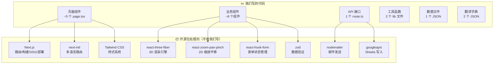

# 04 技术栈选型

> 胶水优先 — 严禁手搓底层逻辑，所有非核心功能用成熟开源包实现

---

## 一、选型原则

| 原则 | 说明 |
|------|------|
| **胶水优先** | 所有功能用成熟的开源包拼接，我们只写"连接"代码 |
| **主流生态** | 选 npm 周下载量 100K+ 的包，确保社区活跃、文档齐全 |
| **零配置** | 优先选开箱即用的方案，减少配置复杂度 |
| **AI 友好** | 选 React/TypeScript 生态，AI 生成代码质量最高 |

---

## 二、核心框架层

| 包名 | 版本 | 用途 | npm 周下载量 | 我们写的胶水代码 |
|------|------|------|-------------|----------------|
| **next** | 14.x | 全栈框架（SSG + API Routes） | 6M+ | 页面路由 + 布局 |
| **react** | 18.x | UI 库 | 25M+ | 组件编写 |
| **typescript** | 5.x | 类型安全 | 50M+ | 类型定义 |
| **tailwindcss** | 3.x | CSS 样式 | 10M+ | class 组合 |

> **胶水说明**：Next.js 自带路由、构建、部署能力，我们只需要写页面组件和 API 接口，不需要配置 Webpack/Babel 等底层构建工具。

---

## 三、3D / 2D 展示层

| 包名 | 用途 | 我们写的胶水代码 |
|------|------|----------------|
| **@react-three/fiber** | Three.js 的 React 封装，渲染 3D 场景 | 约 30 行：加载模型 + 设置灯光相机 |
| **@react-three/drei** | 常用 3D 组件库（轨道控制、加载器等） | 约 10 行：引入组件即用 |
| **three** | 底层 3D 引擎（自动安装为依赖） | 不直接使用 |
| **react-zoom-pan-pinch** | 图片缩放/平移/捏合 | 约 15 行：包裹图片组件 |

### 3D 查看器胶水代码示意

```tsx
// 这就是我们要写的全部 3D 代码（约 30 行）
import { Canvas } from '@react-three/fiber'
import { OrbitControls, Stage, useGLTF } from '@react-three/drei'

function ModelViewer({ modelPath }: { modelPath: string }) {
  const { scene } = useGLTF(modelPath)
  return (
    <Canvas camera={{ position: [0, 0, 5] }}>
      <Stage environment="city" intensity={0.6}>
        <primitive object={scene} />
      </Stage>
      <OrbitControls autoRotate />
    </Canvas>
  )
}
```

### 2D 图纸查看器胶水代码示意

```tsx
// 约 15 行
import { TransformWrapper, TransformComponent } from 'react-zoom-pan-pinch'

function DrawingViewer({ imagePath }: { imagePath: string }) {
  return (
    <TransformWrapper initialScale={1} minScale={0.5} maxScale={4}>
      <TransformComponent>
        
      </TransformComponent>
    </TransformWrapper>
  )
}
```

> **胶水说明**：3D/2D 展示的所有底层逻辑（WebGL 渲染、手势识别、矩阵变换）全部由开源库处理，我们只负责传入模型/图片路径和配置参数。

---

## 四、业务功能层

| 包名 | 用途 | 我们写的胶水代码 |
|------|------|----------------|
| **react-hook-form** | 表单状态管理 | 表单字段注册 + 提交处理 |
| **zod** | 表单数据验证 | 定义验证规则 Schema |
| **@hookform/resolvers** | 连接 react-hook-form 和 zod | 1 行配置 |
| **nodemailer** | 发送邮件（询盘通知） | 约 20 行：配置 SMTP + 邮件模板 |
| **googleapis** | Google Sheets API 写入 | 约 25 行：认证 + 追加行 |
| **next-intl** | 国际化 i18n | 中间件配置 + 翻译字典 |

---

## 五、完整依赖清单

```json
{
  "dependencies": {
    "next": "^14.0.0",
    "react": "^18.0.0",
    "react-dom": "^18.0.0",
    "@react-three/fiber": "^8.0.0",
    "@react-three/drei": "^9.0.0",
    "three": "^0.160.0",
    "react-zoom-pan-pinch": "^3.0.0",
    "react-hook-form": "^7.0.0",
    "@hookform/resolvers": "^3.0.0",
    "zod": "^3.0.0",
    "nodemailer": "^6.0.0",
    "googleapis": "^130.0.0",
    "next-intl": "^3.0.0"
  },
  "devDependencies": {
    "typescript": "^5.0.0",
    "tailwindcss": "^3.0.0",
    "@types/react": "^18.0.0",
    "@types/nodemailer": "^6.0.0",
    "@types/three": "^0.160.0"
  }
}
```

> **总计 13 个运行依赖 + 5 个开发依赖**，全部为主流成熟包。

---

## 六、胶水架构总览



> **我们写的代码量占比约 10-15%，其余 85-90% 的功能由开源包提供。** 这就是"胶水优先"的核心思路。
